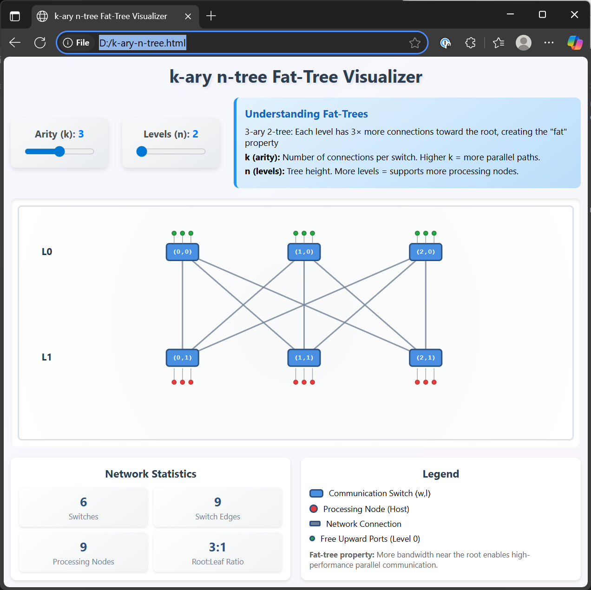

# k-ary n-tree visualizer

This repo is primarily for a interactive utility for visualizing k-ary n-tree's

## how to use the visualizer

1. clone the repo

```
git clone https://github.com/hyposcaler-bot/k-ary_n-tree.git
```

use your browser to open the file k-ary_n-tree_viz.html file found in the root of the repo.

## Screenshot



## What is a k-ary n-tree

In short it is a fat-tree

In 1997 Fabrizio Petrini and Marco Vanneschi from the Department of Computer Science at the University of Pisa in Italy published a paper entitled [k-ary n-trees: High Performance Networks for Massively Parallel Architectures](https://ieeexplore.ieee.org/document/580853)

In part Petrini and Vanneschi's paper built on Charles E. Leiserson's article from 1985 [Fat-trees: Universal networks for hardware-efficient supercomputing](https://ieeexplore.ieee.org/abstract/document/6312192).  In the time between Leiserson paper, and Petrini/Vanneschi's paper, Fat-trees had seen considerable use as interconnects in supercomputing.   

While Leiserson's paper provides a general description of Fat-trees and does a great deal of work to prove them as being useful as Universal networks, Petrini and Vanneschi's paper provides a formal definition for them. 

## Similarity to a Clos

in 1952 Charles Clos authored a paper entitled [A Study of Non- Blocking Switching Networks](https://ieeexplore.ieee.org/document/6770468).  In this paper Clos was primarily exploring optimal strategies for creating multi-stage networks from individual crossbar fabrics.   The stratagies he came up with in would go on to be known as Clos networks.

It it frenquently said that Fat-trees are Clos, but not all Clos are Fat-trees.  In particular a Clos built using the same value for m, n and r does indeed have sub-graphs that are Fat-Trees

if you split the middle stage nodes of a Clos you will end up with two separate graphs each resembling a k-ary n-tree. 

The roots of a A k-ary n-tree always have unused ports for connecting to yet another level of roots.

To build a Clos from a k-ary n-tree, you simple reflect the entire tree structure across the root switches, creating a symmetric fabric.

As an example with a 3 stage Clos

- The ingress & middle stages are a k-ary 2-tree
- The egress and middle stages also are a k-ary 2-tree

This creates the characteristic "folded" Clos topology where packets can traverse: Host → Ingress Tree → Middle Stage → Egress Tree → Host.  

This is why people often equate Fat-Tree's with Clos. The ingress and middle stage of a Clos form a fat-tree as desribed by Petrini and Vanneschi as does the middle-stage and egress stage.

## Why are k-ary n-trees important to datacenter networking?

The combined work of Charles Clos, Charles Leiserson, F. Petrini, M. Vanneschi would go on to inform the work of Mohammad Al-Fares, Alexander Loukissas, and Amin Vahdat's in their 2008 paper [A Scalable, Commodity Data Center Network Architecture](https://dl.acm.org/doi/abs/10.1145/1402958.1402967) which in turn would influence how modern datacenter networks have been built since.

## Definition of a k-ary n-tree/fat-tree

The following definitions were pulled from section 2 of Petrini and Vanneschi's paper and used as the foundation for the visualizer

### Fat-tree Definition

*(Fat-tree)*: A fat-tree is a collection of vertices connected by edges and is defined recursively as follows:

- A single vertex by itself is a fat-tree. This vertex is also the root of the fat-tree.
- If v₁, v₂, ..., vᵢ are vertices and T₁, T₂, ..., Tⱼ are fat-trees, with r₁, r₂, ..., rₖ as roots (j and k need not be equal), a new fat-tree is built by connecting with edges, in any manner, the vertices v₁, v₂, ..., vᵢ to the roots r₁, r₂, ..., rₖ. The roots of the new fat-tree are v₁, v₂, ..., vᵢ.

### k-ary n-tree Definition

*(k-ary n-tree)*: A k-ary n-tree is composed of two types of vertices:

### Components
- **Processing nodes**: N = kⁿ processing nodes
- **Communication switches**: nkⁿ⁻¹ switches of arity k × k

### Node and Switch Representation
- Each **processing node** is an n-tuple: (p₀, p₁, ..., pₙ₋₁) where pᵢ ∈ {0, 1, ..., k-1}
- Each **communication switch** is defined as an ordered pair: ⟨w, l⟩ where:
  - w ∈ {0, 1, ..., k-1}ⁿ⁻¹ (an (n-1)-tuple)
  - l ∈ {0, 1, ..., n-1} (the level)

### Connection Rules

#### Switch-to-Switch Connections
Two switches ⟨w₀, w₁, ..., wₙ₋₂, l⟩ and ⟨w₀', w₁', ..., wₙ₋₂', l'⟩ are connected by an edge if and only if:
- l' = l + 1
- wᵢ = wᵢ' for all i ≠ l

The edge is labeled with:
- w₀' on the level l vertex
- wₗ on the level l' vertex

#### Switch-to-Node Connections
There is an edge between the switch ⟨w₀, w₁, ..., wₙ₋₂, n-1⟩ and the processing node (p₀, p₁, ..., pₙ₋₁) if and only if:
- wᵢ = pᵢ for all i ∈ {0, 1, ..., n-2}

This edge is labeled with pₙ₋₁ on the level (n-1) switch.

## Mathematical Notation Summary

| Symbol | Meaning |
|--------|---------|
| k | Arity parameter (number of connections per switch) |
| n | Dimension parameter (tree height) |
| N = kⁿ | Total number of processing nodes |
| nkⁿ⁻¹ | Total number of k×k communication switches |
| ⟨w, l⟩ | Communication switch at level l with address w |
| (p₀, p₁, ..., pₙ₋₁) | Processing node address |
| {0, 1, ..., k-1}ⁿ | Set of all possible n-tuples with elements from {0, 1, ..., k-1} |
